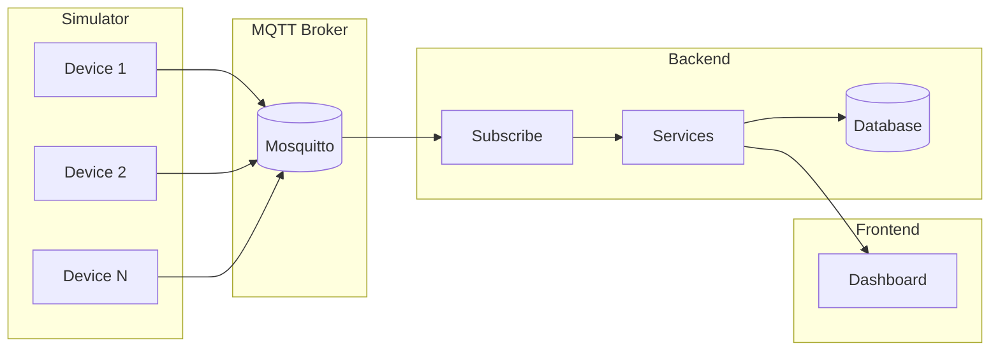

# IoT Watch — Architecture

## System Overview

IoT Watch uses a **publish-subscribe** pattern: devices publish telemetry to an MQTT Broker, and the backend subscribes to receive and process data.

## Data Flow



## Components

| Component | Technology | Role |
|-----------|------------|------|
| Device Simulator | Python | Publishes telemetry to MQTT at 2–5s intervals |
| MQTT Broker | Mosquitto | Receives messages and routes to subscribers |
| Backend | FastAPI | Subscribes to MQTT, stores data, exposes REST API |
| Database | PostgreSQL | Stores devices, sensor data, alerts |
| Frontend | Next.js | Dashboard for viewing data and alerts |

## Topic Design

| Topic | Direction | Description |
|-------|-----------|-------------|
| `devices/{device_id}/telemetry` | Device → Broker | Device publishes telemetry |
| `devices/+/telemetry` | Broker → Backend | Backend subscribes; `+` matches any device_id |

## Device Status

- **Online**: Device has sent data within the last 10 seconds (`last_seen` is recent)
- **Offline**: No data for more than 10 seconds

## Alert Rules (MVP)

| Type | Condition |
|------|-----------|
| HIGH_TEMPERATURE | `temperature > 35` |
| LOW_BATTERY | `battery < 20` |
| OFFLINE | No data for 10+ seconds |

## Docker Compose Services

Docker 相关文件位于 `docker/` 目录，统一管理。

```
docker/
├── docker-compose.yml   # mqtt、db、backend
├── mosquitto.conf       # MQTT Broker 配置
└── README.md

services:
  mqtt:     # Mosquitto (port 1883)
  backend:  # FastAPI (port 8000)
  db:       # PostgreSQL (port 5432)
```

## Access URLs

- Dashboard: http://localhost:8000
- API Docs: http://localhost:8000/docs
